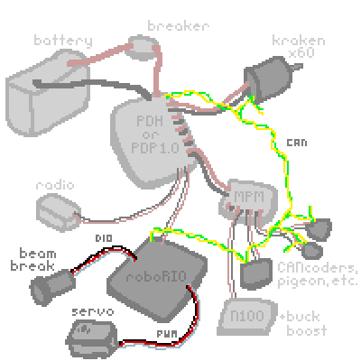
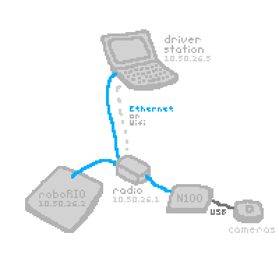
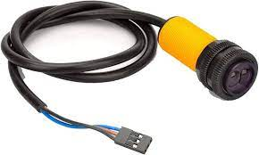
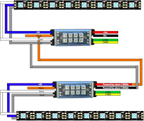
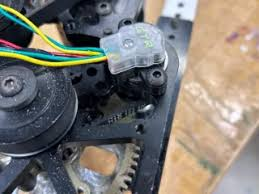
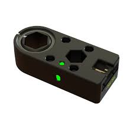

work in progress!

## :What is this?
This is a guide for the full systems of the robot. Hopefully you'll learn something, no matter what subteam you're on! The expandable explanations are created using [:nutshell](https://ncase.me/nutshell/#WhatIsNutshell)

## :What controlls the robot during a match?

The robot is controlled by the RoboRIO, which acts as the central brain, processing inputs from drivers and sensors. During a match, it will execute our code to command subsystems like the drivetrain, intake, and shooter.

## :How is power distributed?

A 12v lead-acid battery powers all components on the robot. Its important that we use a battery in [:good condition](#battery-beak) and have secure wiring, because any voltage drops can cause performace issues or even reboot the RoboRIO (very bad)

The battery connects to the PDH/PDP with a breaker in between. The [:breaker](#breaker) is the on switch of the robot. Turn it on by pressing 

The [:PDH/PDP](#pdh-and-pdp) splits the power into many channels. Each motor connects to one of these channels with thick red and black [:wires](#wires-and-fuses). Each of those channels has a fuse, so if there is a surge of power the fuse will pop instead of it damaging a motor.

Some robot components require much less power than the motors. The [:MPM](#mpm) has channels similar to the PDH, but provides channels for small power. Devices that connect to the CAM are [:beam breaks](#beam-break), [:N100s](#n100), [:CANcoders](#cancoders), and the [:Pigeon](#pigeon). One MPM channel can often power multiple devices. 

note that things are slightly different for the PDP 2.0. also, the radio is actually powered redundantly with [:POE](#radio)

## :How do components communicate with the roboRIO?

The roboRIO mainly has four ways of communication: CAN, PWM, DIO, and ethernet.

The most important one is the [:CAN bus](#can-bus). It's a two-wire comminication system that connects devices like [::igeons](#pigeon), [:CANdles](#candle), [:CANcoders](#cancoders), and [:motor controllers]() in a daisy chain. Each device has a unique [:ID](#can-ids).

[:DIO](#dio) ports are used to send simple on/off signals. DIO is great for small sensors like limit switches and [:beam breaks](#-bream-breaks).

[:PWM](https://en.wikipedia.org/wiki/Pulse-width_modulation) can be used to control [:servos](servos) or older PWM motor controllers We would only use it when a device doesn't support CAN, since CAN is bi-directional and can send much more data.

We'll talk about ethernet in the next section

## :What does the robot's network look like?

The robot's network is built around the radio. It creates a private network for the robot under the team's [:IP](#ip) range and connects to the field management system (FMS) during matches. 

The radio connects to the RoboRIO and N100s via ethernet, allowing them to transmit data to each other. The cameras are connected and powered by the N100, which processes image data and sends it to the RoboRIO over ethernet, allowing it to make autonomous decisions.

The radio can connect to the [:driver station](#drive-station) over wifi, or it can be tethered directly with ethernet.

## :What is the code actually doing during a match?
Our robots code is command-based. Its based around two core [:abstractions](#abstraction): Subsystems and Commands

](command_based.svg)

W

## :What is version control?

## :How does the vision system work?
camera camera camera

## :How do purchases work?
email to someone to create a [PO](#purchase-order)

## :How do we transport all our stuff to competition?

## :What is scouting for?

## :What is the district system?

## :Who made this?

---

### :Radio
radio radio radio

### :Drive Station
drivity drive drive drive

### :roboRIO 2.0
rio rio rio

### :PDH and PDP
PDH: Power Distrubution Hub

PDP: Power Distribution Power

### :Breaker
*video of someone turing the robot on and off 

## :What wires and fuses do you use?
This is complicated.

### :Bream breaks

### :Pigeon
The gyroscope of the robot. This has to be in the very center of the robot!

### :CANdle
A device to control light strips. It revieves data through CAM 

### :CANcoders
CAN + encoder = cancoder

An encoder measures the rotation of a shaft. The CAN part means it transmits this data over the CAN bus

### :N100
An intel computer. They are powered by a [:buck-boost converter](https://en.wikipedia.org/wiki/Buck%E2%80%93boost_converter)

### :CAN IDs
We have a spreadsheet to keep track of this

### :Can Bus
The CAN starts at the roboRIO and ends at the PDP because the CAN network is required to be terminated by 120 Ω resistors and these are built into these two devices.

[:video explanation](https://www.youtube.com/watch?v=YBrU_eZM110)

### :DIO
Digital Input Output.

There are three wires: red, white and black. The red wire is usually 5v, the black wire is 0v, and the white wire is in between that. The white wire measures the tou

### :Field Management System

### :PWM

### :MPM
Mini Power Module also known as a [:MPM](#mpm). it has a [:fuse](https://en.wikipedia.org/wiki/Fuse_(electrical))

### :IP
FRC has a pretty good explanation of how IP works [:here](https://docs.wpilib.org/en/stable/docs/networking/networking-introduction/networking-basics.html#networking-basics)

### :Motors
Motors used to be so much complicated lol. now we just krakens becasue they COOK

### :Motor controllers
Kraken and Falcon motors have build in motor controlers to the back, Talon FX. 

other teams might have external motor controlers, such as SPARK MAX

### :Coordinate System
nora can you write this? :)

### :Abstraction
Abstraction is the concept of hiding complex implementation details and exposing only the necessary parts of a system through a simplified interface. In FRC, abstraction lets you control a robot mechanism using simple commands without needing to directly manage motor speeds, sensor readings, or hardware configurations each time.

In our code you might see something like 

`superstructureIO.stop()`

The superstructure is an abstraction. (ok the class structure is actually [:so much more complicated](#class-structure))

### :Battery Break
We use a battery beak to measure the voltage of each battery. However, info it gives is not the most useful. [:This conference]() gives a bit of an explanation why. This system may be changed in the future.

