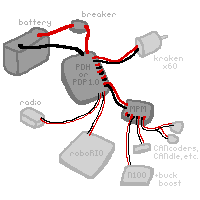

I hope to make an overview of the full systems within the robot. To get a description and more info,  [:underlined terms](#nutshell) 👈 click

- [Robot components](#robot-components)
- [Programming overview](#programming-overview)
- [Manufacturing](#manufacturing)
- [design](#)
- [competitions](#)
- [electrical details](#more-electrical-details)
- [programming details](#)

## Robot components

[:asf](https://www.team5026.com/2022-2023_Robot_CAN_Documentation)

### Robot Overview

This, the [:roboRIO](#roborio), is the “brains” of the robot. We upload code to it before a match, and during a match it will revieve inputs from the driver through the [:radio](#radio).The roboRIO knows its position on the field and whether it has a game piece or not. It will process the inputs and control the motors. 

### Power Distribution

Here's a diagram on how the battery powers the robot! We'll start with

A 12v battery powers the robot. Its important that we [:take care of our batteries](#battery-care)

The battery connects to the PDH/PDP with a breaker in between. The [:breaker](#breaker) is the on switch of the robot. The [:PDH/PDP](#pdh-and-pdp) splits the power into many channels. Each motor connects to one of these channels with thick red and black [:wires](#wires-and-fuses). Each of those channels has a fuse, so if there is a surge of power the fuse will pop instead of it damaging a motor.

Some robot components require much less power than the motors. The [:MPM](#mpm) has channels similar to the PDH, but provides channels for small power. Devices that connect to the CAM are [:beam breaks](#beam-break), [:N100s](#n100), [:CANcoders](#cancoders), and the [:pigeon](#pigeon). One MPM channel can often power multiple devices. 

*note that things are slightly different for the PDP 2.0

### Communication to the roboRIO
We also need wires to transmit data! Lets revise our diagram to include it:

*diagram involving CAN
The roboRIO mainly uses three communication protocols: CAN, PWM, and DIO.

The most important one is the [:CAN bus](#can-bus). It's a two-wire comminication system that connects devices like [Pigeons](#pigeon), [:CANdles](#candle), [:CANcoders](#cancoders), and [:motor controllers]() in a daisy chain. Each device has a unique [:ID](#can-ids).

[:DIO]

[:PWM]

To communicate to the roboRIO, components either [:PWM](https://en.wikipedia.org/wiki/Pulse-width_modulation), [:DIO](#dio), or [:CAN](https://www.youtube.com/watch?v=YBrU_eZM110).

### Communication to drivers

ethernet

## Programming overview

### Cameras
camera camera camera

### Radio
radio radio radio

### Drive Station
drivity drive drive drive

## Electrical details

### roboRIO
rio rio rio

### PDH-and-PDP
PDH: Power Distrubution Hub
PDP: Power Distribution Power

### Breaker
*video of someone turing the robot on and off 

### Wires and fuses
This is complicated.

### Bream breaks

### Pigeon
The gyroscope of the robot. This has to be in the very center of the robot!

### CANdle
A device to control light strips. It revieves data through CAM 

### CANcoders
CAN + encoder = cancoder

An encoder measures the rotation of a shaft. The CAN part means it transmits this data over the CAN bus

### N100
An intel computer. They are powered by a [:buck-boost converter](https://en.wikipedia.org/wiki/Buck%E2%80%93boost_converter)

### can-ids
We have a spreadsheet to keep track of this

## Programming details

## Manufacturing

## Other

### DIO
digital input output.

the thing provides resistance or something

### MPM
Mini Power Module also known as a [:MPM](#mpm). it has a [:fuse](https://en.wikipedia.org/wiki/Fuse_(electrical))

### Can Bus

### Wires and Fuses
There is a strict sysetem of this

