# everything doc v0.2

## What is this?
This is a guide to the full systems of the robot. There are two goals of this doc: to keep the team sustainable by detailing how all parts of the robot integrate with one another, and to ensure every team member understands what they are doing within a bigger picture.

One of the biggest factors in team success is sustainability. If our team has really strong fundamentals, we'll build up more and more knowledge and experience over the years, eventually becoming a [:powerhouse](#powerhouses) or something! It's extremely dangerous whenever a lot of knowledge about a [:subteam](#subteams) is concentrated in one mentor or team member. I'd like to prevent any major loss of knowledge from ever happening :)

The target audience are people who have been introduced to the team the normal way. They've went through the training of one subteam and have a good understanding of what [:FRC](#WhatIsFRC) is. They've have a decent understanding of one subteam, but feel like there are many gaps in their understanding and want to learn more! 

I'm hope to gather information so this becomes the thing I wish *I* had when I was joining the team. This is meant as a top down read. Click through the sections and open up any dropdown that you're interested in! At the bottom I'll include some of my own experiences on the team. (writing wiki pages wouldn't achieve what I had in mind). These expandable explanations are made with a tool called [:nutshell](#).

First, we'll cover the robot's components, since electrical is the backbone of the robot. Then we'll go into a bit of what programming is doing. Next that I'll write down everything I know about engineering– tools, the CNC, and the design process. After that will be more specifics of electrical and programming. In the end, I'll talk about how the team runs, competitions, graphic design, and maybe a lil' team history.

## What makes the robot move?

 At the very center of the robot is this computer, the RoboRIO. It run the code, taking sensor inputs, processing data, and controlling motors.

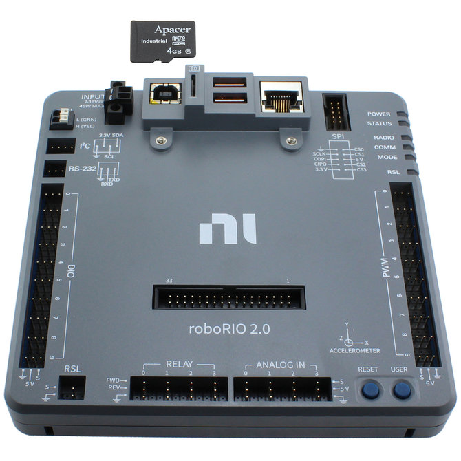

Here's a quick explanation of the important the components on the robot:

](<FRC Kraken X60.jpeg>)

](<MK4i Swerve Module.jpeg>)

 in images from our cameras](<FRC N100.png>)

](<FRC Candle.jpeg>)

There are two types of wires, either transmitting data or power.  In the next section we'll go into how each component is powered, and after that we'll go into the wiring used in communication.

## How is power distributed?

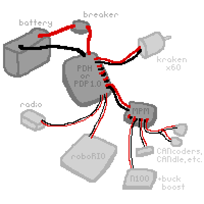

A 12v lead acid battery powers the robot. Before matches, we use a Battery Beak to test out and find the best battery [[:note](#batteryIssues)]. It's important that we choose a good battery because any voltage drops can cause performance issues. [[:more info](FIX)]

The battery connects to the PDH/PDP with a breaker in between. Turn the robot on by pushing the lever on the breaker in. Turn if off by pressing the red button. If too much current (FIX) goes through the breaker it will shut off power, preventing the robot from exploding.

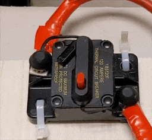
 
The PDH/PDP distributes power throughout the robot by splitting it into channels. The PDH and PDPs have the same purpose, but differ on how many channels they have, [:etc](#PDHvsPDP). Each motor is powered by one of a channels in the PDH/PDP with red and black wires. Each of these channels are protected with a fuse. FRC is quite strict on which [:wire gauge and fuse](#GaugesAndFuses) you use.
  
Some robot components require much less power. The MPM provides channels for low power devices. Some devices that are powered by the MPM include [:beam breaks](#FIX), encoders, and the Pigeon. One MPM channel can often power multiple devices, like with all the encoders on the swerve module

See this [:diagram](<Electrical Documentation.png>) by Cat for an accurate drawing

The radio is powered a little differently, utilizing [:POE](#poe).

The N100s are powered from the MPM with a buck-boost converter in between, which keeps the power at a steady 12V.

## How do components communicate within the robot?

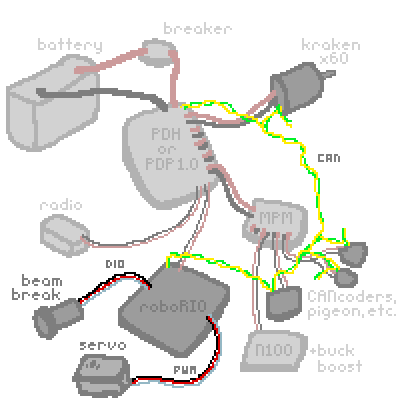

There are many ways components on the robot can communicate with the RoboRIO, but the most important one is the CAN bus. The CAN bus is characterized by thin yellow and green wires. Everything is on one long daisy chain, so all data sent out will be received by every device. Each device has a different ID, so only one will interpret each packet. We keep track of all the IDs on a spreadsheet.

CAN is a differential pair. A byte of data is represented by a difference in voltage between the two wires. This, and twisting the wires, helps to reduce noise and interference.

Another great thing about CAN is that it is two-way. The RoboRIO can tell the motor controllers what to do and it can report back its angle. Our encoders can also be called CANcoders because they communicate over CAN. The CANdle (i think its a pun because candles emit light??) and Pigeon also uses CAN. [[:learn more](FIX)]
  
The RoboRIO also has ports for DIO communication. DIO is used to send simple on/off signals, which is great for small sensors like [:beam breaks](FIX) and limit switches. [[:learn more](FIX)]

Additionally, the RoboRIO also has PWM. Its mostly used for [:older motor controllers](FIX) and components, but we may still use it for [:servos](FIX). We would only use it when a device doesn't support CAN, since CAN is bi-directional and can send much more data. [[:learn more](https://en.wikipedia.org/wiki/Pulse-width_modulation)]

Finally, the RoboRIO communicates with the radio and N100s over ethernet and the cameras are connected to the N100s via USB
  
## What does the robot's network look like?

Depending on where the robot is being used, the configuration on how the Driver Station communicates with the roboRIO varies.

Here is a tethered Ethernet setup, which you might see used in the pits. The drive station connects to the radio, which is connected to the roboRIO. The radio acts a switch. We assign each device its own IP within our team's [:subnet](#subnets) (for example its `10.50.26.5` for the Driver Station, `10.50.26.2` for the roboRIO).

Technically you can also connect the roboRIO directly to the laptop with USB-B, but we'd only use that as backup.

During drive practice we have a configuration with two radios. One is mounted on the robot as the client and a second is configured as a wireless access point (AP). The Driver Station and roboRIO both connect wirelessly to the AP. The IP addresses and subnet works the same as before. 

[Here](https://frc-radio.vivid-hosting.net/) is the documentation for our VH-109 radio.

During an official match, the robot's network is fully integrated into the Field Management System (FMS). Each team's robot connects to the field's AP, a wifi router. The Driver Station connects to the field through a hardwired Ethernet connection at the player station, which links to the FMS network. 

The FMS assigns each team its own VLAN and subnet. The field switches enforce the VLAN, ensuring that each team's traffic is completely isolated. The FMS server monitors the match. It synchronizes timing and can disable robots.

See [:this](<FMS Whitepaper 2025.1.webp>) for the full diagram of a match network

## What is the code actually doing during a match?

Our robots code is command-based. Its based around two core [:abstractions](#abstraction): Subsystems and Commands

  

](command_based.svg)

  

Commands represent actions the robot can take

  

## What is version control?

  
  

## How does the vision system work?

camera camera camera

  
  

## How do purchases work?

email to someone to create a [PO](#purchase-order)

  

## How do we transport all our stuff to competition?

  

## What is scouting for?

  

## What is the district system?

  

## Who made this?

  

---

  
  

### :Radio

radio radio radio

  

### :Drive Station

drivity drive drive drive

  

### :roboRIO 2.0

rio rio rio

  

### :PDH and PDP

Power Distrubution Hub / Power Distrubution Port

  

The PDP 1.0, PDH, and PDP 2.0 have the same purpose of distrubuting power, but they have significant differences!

  

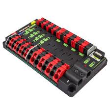

  

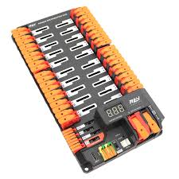

  

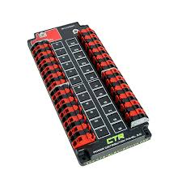

  

[:see more about the wiring](#)

  

### :Breaker

*video of someone turing the robot on and off

  

## :What wires and fuses do you use?

This is complicated.

  

### :Bream breaks

  

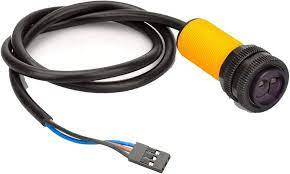

  

### :Pigeon

The gyroscope of the robot. This has to be in the very center of the robot!

  

### :CANdle

A device to control light strips. It revieves data through CAM

  

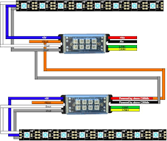

  

### :CANcoders

CAN + encoder = cancoder

  

An encoder measures the rotation of a shaft. The CAN part means it transmits this data over the CAN bus

  

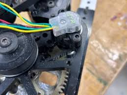

  

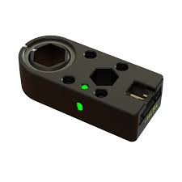

  

### :N100

An intel computer. They are powered by a [:buck-boost converter](https://en.wikipedia.org/wiki/Buck%E2%80%93boost_converter)

  

### :CAN IDs

We have a spreadsheet to keep track of this

  

### :Can Bus

The CAN starts at the roboRIO and ends at the PDP because the CAN network is required to be terminated by 120 Ω resistors and these are built into these two devices.

  

[:video explanation](https://www.youtube.com/watch?v=YBrU_eZM110)

 

### :IP

FRC has a pretty good explanation of how IP works [:here](https://docs.wpilib.org/en/stable/docs/networking/networking-introduction/networking-basics.html#networking-basics)

### :Abstraction

Abstraction is the concept of hiding complex implementation details and exposing only the necessary parts of a system through a simplified interface. In FRC, abstraction lets you control a robot mechanism using simple commands without needing to directly manage motor speeds, sensor readings, or hardware configurations each time.

  

In our code you might see something like

  

`superstructureIO.stop()`

  

The superstructure is an abstraction. (ok the class structure is actually [:so much more complicated](#class-structure))

