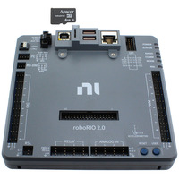

I hope to make an overview of the full systems within the robot. To get a description and more info,  [:underlined terms](#nutshell) 👈 click

- [Robot components](#robot-components)
- [Programming overview](#programming-overview)
- [Manufacturing](#manufacturing)
- [design](#)
- [competitions](#)
- [electrical details](#more-electrical-details)
- [programming details](#)

## Robot components

### Robot Overview

This, the [:roboRIO](#roborio), is the “brains” of the robot. We upload code to it before a match, and during a match it will revieve inputs from the driver through the [:radio](#radio).The roboRIO knows its position on the field and whether it has a game piece or not. It will process the inputs and control the motors. 

### :Power Distribution

Here's a diagram on how the battery powers the robot

On the robot we have a 12v battery. We need a new battery every match and they take a while to charge, so we have a whole cart full fo them! We use(d) a [:battery beak](#battery-break) to find the best one. [:please take good care of the batteries](#battery-care)

The battery connects to the PDH/PDP with a breaker in between. The [:breaker](#breaker) is the on switch of the robot. The [:PDH/PDP](#pdh-and-pdp) splits the power into many channels. Each motor gets power by connecting to one of these channels with [:thick](#wire-gauges) red and black wires. Each of those channels has a fuse, so if there is a surge of power the fuse will pop instead of it damaging a motor.

Some robot components require much less power than the motors. The [:MPM](#mpm) has channels similar to the PDH, but provides channels for small power. Devices that connect to the CAM are [:beam breaks](#beam-break), [:N100s](#n100), [:CANcoders](#cancoder), and the [:pigeon](#pigeon). One MPM channel can often power multiple devices. 

### :Communication to the roboRIO
We also need wires to transmit data! Lets revise our diagram to include it!

*diagram involving CAN
To communicate to the roboRIO, components either [:PWM](#pwm), [:DIO](#dio), or [:CAN](https://www.youtube.com/watch?v=YBrU_eZM110).

CAN is the one 
Devices that communicate to the roboRIO via CAN are the [:roboRIO](#roborio), [:Pigeon](#pigeon), [:][:CANdle], [:PDH/PDP]

### Communication

## Programming overview

### Cameras
camera camera camera

### Radio
radio radio radio

### Drive Station

## Electrical details
### roboRIO
### PDH-and-PDP
### Breaker

## Programming details

## Manufacturing

### What powers the robot? (overview)

### How do the motors work?
*image of kraken
The motors that we use are Krakens. There are cool becasue they are brushless motors with a built in [motor controller](). 

*its really cool and you should do some learning on this on your own!
**other teams need to use an external device, like this SPARK MAX
[what about servos?](sercos)
[what about encoders?](#Encoders?)
[how does programming work with this?]
### How do the motors communicate with the roboRIO?
The CAN bus is the yellow and green wires that go throughout the bot. 
There are two wires because it forms a differntial pair, which mitigates any noise.

*controller area network
*pulse width modulation
We also 

[pdh]: linklink

## General engi stuff

### PWM
pulse width mudolcation

### DIO
digital input output

### MPM
Mini Power Module also known as a [:MPM](#mpm). it has a [:fuse](https://en.wikipedia.org/wiki/Fuse_(electrical))

### Can Bus

